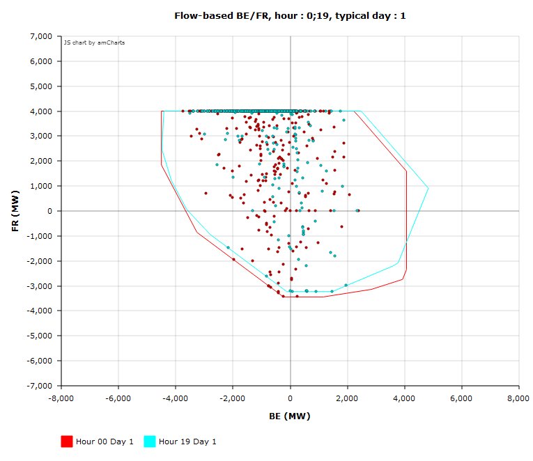
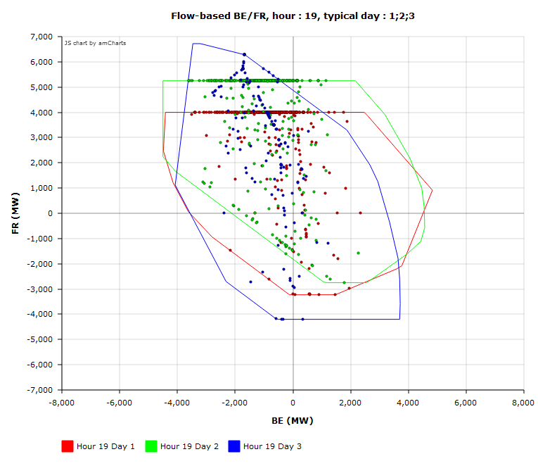
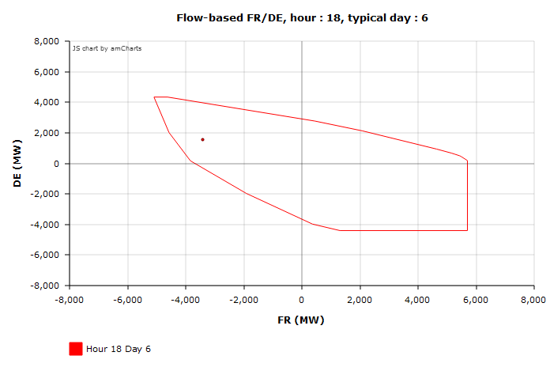
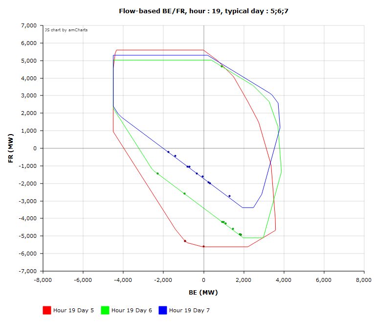
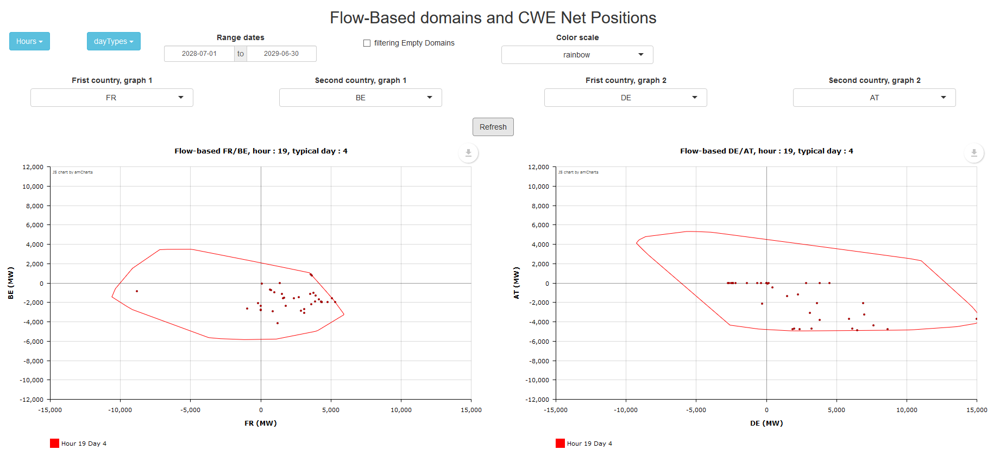

  
```{r setup, include=FALSE}
knitr::opts_chunk$set(echo = TRUE)
```


``fbAntares`` allows to model **flow-based** domains into adequacy studies using the software *Antares*, with the following main functionalities: 

**1. Preparation of the input of an Antares study to include a modelling a flow-based in the CWE-AT area**

- Projection of flow-based domains on a fix basis  so as to be able to describe them in Antares with binding constraints.
- Construction of probabilistic flow-based time series respecting the correlations with other inputs of the study (e.g. load, wind power generation, solar generation).
- Automatic filling of the inputs of the Antares study 

**2. Post-processing and visualisation of Antares’ results**

- Application of the adequacy patch to re-balance the exchanges in the CWE-AT area in case of generation shortages
- Visualisation of the net-positions of the countries of the CWE-AT area along with the limits imposed by the flow-based domains


This vignette describes the second set of functionnalities : the post-processing of the simulation results.


## 1 - Summary

```{r, eval=FALSE}

# Set Antares study path and read the simulation results
study <- "MyStuDy"
opts <- antaresRead::setSimulationPath(study, 2)
dta <- antaresRead::readAntares(areas = c("fr", "be", "de", "nl", "at"),
                                links = c("be - de","be - fr","be - nl",
                                          "de - fr","de - nl", "at - de"), mcYears = 1:10,
                                select = c("LOLD", "UNSP. ENRG",
                                           "DTG MRG", "UNSP. ENRG", "BALANCE", "FLOW LIN."),
                                opts = opts)


# Add to the results the time series of typical flow-based days
dta <- addTypicalDayId(dta)


# Apply the adequacy patch on the results
dta_adq <- adqPatch(mcYears = "all", pre_filter = FALSE, strategic_reserve_be = NULL,
                    strategic_reserve_de = NULL, opts = antaresRead::simOptions(),
                    fb_opts = opts, select = NULL, keepOldColumns = TRUE)


# Visualise the flow-based exchanges (position in the flow-based domains) 
# Plot a domain and the matching output positions
plotNetPositionFB(fb_opts = opts,
                  data = dta, areaName = "cwe_at",
                  dayType = 1, hour = c(0, 19),
                  country1 = "BE", country2 = "FR")

# Run a shiny application to visualise the domains and matching output positions
runAppPosition(dta)


# Add to the results a calculation of the net position of the countries within an area (by default, position in CWE)
dta <- addNetPosition(data, opts = antaresRead::simOptions(), 
                      inAreas = c("be",  "de", "fr", "nl", "at"), newName = "_CWEAt")


```


## 2 - Post-processing : addition of typical days time series
```{r, eval=FALSE}

antaresRead::setSimulationPath("MyStuDy", 1)
dta <- readAntares(areas = "all", links = "all", clusters = "all" ,mcYears = 1:10)
dta <- addTypicalDayId(data = dta)
```

The function ``addTypicalDayId()`` adds to an Antares output table a column indicating the id of the used flow-based typical days at each timestep. It uses the following parameters : 

* ``data`` : Antares output table (loaded by the function ``antaresRead::readAntares``), the function will add a column to this table
* ``fb_opts`` : flow-based model localisation, where the function will read the flow-based time-series to add to the results. It can be a flow-based model designed by ``setFlowbasedPath()``. By default, it will use the odel stored in the Antares study indicated by ``antaresRead::simOptions()``


<!-- ## 3 - Application of the adequacy patch -->
<!-- ## 3.1 - Why the adequacy patch? -->
<!-- Although it is applied as a post-processing for Antares, the adequacy patch is in reality an integral part of the market coupling algorithm. -->

<!-- This patch intervenes in case of unsupplied energy : the optimal situation will be the one reducing the maximum amount of unsupplied energy in the whole interconnected areas and this may lead to increasing the unsupplied energy in some areas (countries exporting while in loss of load situation for example). The aim of the patch is to move from the optimal situation at CWE perimeter to a solution splitting the effort in a « fair » way. -->

<!-- This function is a post-processing of Antares results (optimisation algorithm), its aim is to re-compute the net positions (exports - imports) in the CWE area while :  -->

<!-- * Respecting the flow-based domain limits -->
<!-- * Having for each country imports proportionnal to the amount of unsupplied energy without exchanges -->

<!-- Example : Area "fr" is exporting while having unsupplied energy. After the post-processing, it is exporting only the volume it can to reduce area "be" 's unsupplied energy without endangering its own safety.  -->

<!--  -->


<!-- ## 3.2 - Application of the adequacy patch -->
<!-- ```{r, eval=FALSE} -->
<!-- opts <- antaresRead::setSimulationPath("MyStuDy", 2) -->
<!-- dta <- adqPatch(mcYears = "all", pre_filter = FALSE, strategic_reserve_be = NULL, -->
<!--                 strategic_reserve_de = NULL, opts = antaresRead::simOptions(), -->
<!--                 fb_opts = opts, select = NULL, keepOldColumns = TRUE) -->
<!-- ## or -->
<!-- dta <- adqPatch(fb_opts = opts) -->
<!-- ``` -->

<!-- The ``adqPatch()`` function applies a post-processing on an Antares study output. It loads the results of the study indicated by ``antaresRead::setSimulationPath()`` and selects the times with unsupplied energy to apply the patch optimisation algorithm described above. -->
<!-- By default, the function returns the results for all the MC years : -->

<!-- * areas be, de, fr and nl : BALANCE, LOLD, UNSP. ENRG, DTG MRG -->
<!-- * links be - de, be - fr, be - nl, de - fr, de - nl :  FLOW LIN. -->

<!-- It uses the following parameters : -->

<!-- * ``mcYears`` : selection of MC years to apply the patch on. By default, the value is "all". -->
<!-- * ``pre_filter`` : boolean,  if TRUE, the function selects (by reading annual results) the mcYears during which there is at least one hour of loss of load before applying the adequacy patch, the other years are not loaded and will not appear in the results of the function. By default, the value is FALSE. -->
<!-- * ``strategic_reserve_be`` : name of the area representing the strategic reserve of be, by default NULL. -->
<!-- * ``strategic_reserve_de`` : name of the area representing the strategic reserve of de, by default NULL. -->
<!-- * ``select`` : names of additionnal output colums to have in the results (other than the ones quoted above). These columns are directly loaded from Antares, unchanged. -->
<!-- * ``opts`` : Antares study, indicated by the function ``antaresRead::setSimulationPath()`` -->
<!-- * ``fb_opts`` : simulation parameters returned by the function ``setSimulationPath()`` or flow-based model path obtained with the function ``setFlowbasedPath()``. By default, the value is indicated by ``antaresRead::simOptions()`` -->
<!-- * ``keepOldColumns`` : boolean, if TRUE, the initial columns modified by the adequacy patch are also displayed after the post-processing. By default, the value is TRUE. -->


## 4 - Visualisation of the flow-based exchanges positions
Preliminary step: load the simulation results.

```{r, eval=FALSE}
opts <- antaresRead::setSimulationPath("MyStuDy", 2)
dta <- antaresRead::readAntares(areas = c("fr", "be", "de", "nl"),
                                links = c("be - de","be - fr","be - nl","de - fr","de - nl"), 
                                mcYears = 1:10,
                                select = c("LOLD", "UNSP. ENRG",
                                           "DTG MRG", "UNSP. ENRG", "BALANCE", "FLOW LIN."))
```

## 4.1 - Plot the net positions in CWE calculated by Antares and the used flow-based domains

The function ``plotNetPositionFB()`` is used after running an Antares simulation to visualize how the domains have been used by the optimizer to fix the exchanges in the CWE area.

The parameters used by the function are the following (example on how to use them are described below):

* ``data`` : ``antaresDataList`` Antares output data, imported with ``readAntares()``. It can be a filtered (time or loss of load) antaresDataList.
* ``dayType`` : numeric vector of typical days' domains to plot or "all"
* ``hour`` : numeric vector of hours to plot (between 0 and 23) or "all"
* ``country1`` : name of the country in axis X
* ``country2`` : name of the country in axis Y
* ``fb_opts`` : flow-based model, either defined by ``setFlowbasedPath()`` or in the study indicated by ``setSimulationPath()``. By default : ``antaresRead::simOptions()``
* ``filteringEmptyDomains`` : boolean, if TRUE, the function will not plot the domains which are not used in the data. By default, it is FALSE.
* ``nbMaxPt`` : maximum number of points plotted on the graph. It can be increased (which increases computation time). By default, the value is 10000.
* ``areaName`` : character, name of the area of your study, possible values are
cwe_at (default), cwe and other. If you choose other, you have to give a csv file
which explains how your area work.
* ``palette`` : color range, by default rainbow.


## Plot a domain and the matching net positions
The user chooses the typical day(s) and hour(s), the function will plot the required domain(s) and search the Antares results to calculate the net positions whenever these domains were used by the optimiser. 

```{r, eval=FALSE}
## Plot the typical day 1 at hours 0 and 19 and the matching net positions on a Belgium-France graph
plotNetPositionFB(fb_opts = opts,
                  data = dta,
                  dayType = 1, hour = c(0, 19),
                  country1 = "BE", country2 = "FR")
```




```{r, eval=FALSE}
## Plot the three typical days of summer at hour 19 and the matching net positions
plotNetPositionFB(fb_opts = opts,
                  data = dta,
                  dayType = c(1,2,3), hour = c(19),
                  country1 = "BE", country2 = "FR")
```



## Select a date (or mcYear...) and plot the matching domains
By default, the function draws all the times matching the domains in the entire results table. It is then possible to filter the input table. If so, the parameter ``filteringEmptyDomains`` can be set to TRUE and the parameters ``dayType`` and ``hour`` to ALL. The function will then try and print all the domains, but actually keep only the ones used in the table.

```{r, eval=FALSE}
## Plot only one time, without knowing the used flow-based domain
dta$areas <- dta$areas[timeId == 5659,]
plotNetPositionFB(fb_opts = opts,
                  data = dta, areaName = "cwe_at",
                  dayType = "all", hour = "all",
                  filteringEmptyDomains = TRUE,
                  country1 = "FR", country2 = "DE")
```



## Filtering example : plot the net positions of situations of unsupplied energy
Because of the format of the Antares data table, some caution must be observed when filtering it. For example, to keep only the situations where there is unsupplied energy, one must keep all the rows representing this specific time.
Example :
```{r, eval=FALSE}
## An exemple of authorized filter :
idC <- c(antaresRead::getIdCols(dta$areas))
idC <- idC[idC!="area"]
LOLD <- dta$areas[,lapply(.SD, sum), by = idC, .SDcols = "LOLD"]
LOLD <- LOLD[LOLD!=0]
LOLD[,LOLD := NULL]

# Merge to filter data
dta$areas <- merge(dta$areas, LOLD, by =  idC)
## End filter


## plot domains
plotNetPositionFB(fb_opts = opts,
                  data = dta,
                  dayType = "all", hour = c(19),
                  country1 = "BE", country2 = "FR", filteringEmptyDomains = TRUE)

```



## 4.2 - Run a shiny application to visualise the net positions calculated by Antares and the flow-based domains

One can also visualise the net positions graphs in a shiny application launched with ``runAppPosition``. Threee parameters only are used (``data``, ``fb_opts`` and country_list), the others are available directly in the app.

```{r, eval=FALSE}
runAppPosition(dta)
```


The same filters can also be applied beforehand to select only timesteps with unsupplied energy.


## 5 - Post-processing : addition of the exchange position
```{r, eval=FALSE}
opts <- antaresRead::setSimulationPath("MyStuDy", 2)
data <- readAntares(area = "all", links = "all", mcYears = 1)

##Add net position for CWE
data <- addNetPosition(data, opts)

##Add net position for CWE+AT
data <- addNetPosition(data, opts
                       inAreas = c("be", "de", "fr", "nl", "at"), newName = "_CWEAt")
```

The function ``addNetPosition()`` adds to an Antares output table a column calculating the net position of areas within an interconnected group of areas, based on the exchanged flows. This can be used for flow-based calculation (to get net positions in the CWE perimeter). It uses the following parameters :

* ``data`` :  Antares output table (loaded by the function ``antaresRead::readAntares()``), the function will add a column to this table
* ``opts`` : simulation parameters returned by the function ``setSimulationPath()``: this represents the directory of the Antares study. The default path is indicated by ``antaresRead::simOptions()``.
* ``inAreas`` :  lists of areas belonging to the perimeter, whose exchanges are going to be taken into account in the balance calculation. All links connecting two areas in this list are taken into account, the links connected to only one area (or none) are ignored. By default, the list is c("be", "de", "fr", "nl"), the calculation is carried out on the CWE perimeter.
* ``newName`` : suffix added to the calculated column name. By default, it is "_CWE".


<!-- ## 6 - Post-processing : adequacy patch in h5 format -->
<!-- The funtion ``adqH5()`` enables to apply the adequacy patch on a simulation in h5 format and returns the results in the same format. The plot functions and application can be used on an h5 file. -->

<!-- ```{r, eval=FALSE} -->
<!-- ## Select the Antares simulation -->
<!-- # Select the output in a classic format -->
<!-- opts <- antaresRead::setSimulationPath("MyStuDy",2) -->
<!-- # Write the study in h5 format -->
<!-- antaresRead::writeAntaresH5() -->
<!-- # Select the simulation now in an h5 file -->
<!-- opts <- antaresRead::setSimulationPath("MyNewStudy",1) -->


<!-- ## Select the flow-based model to use. The function setFlowbasedPath can also be used -->
<!-- fb_opts = antaresRead::setSimulationPath("MyOldStudy", 2) -->


<!-- ## Apply the adequacy patch -->
<!-- adqH5(opts = opts, fb_opts = fb_opts, -->
<!--       strategic_reserve_be = NULL, strategic_reserve_de = NULL) -->


<!-- ## Set alias for an easy read of the file afterwards -->
<!-- setAlias("adqPatch", "Alias for adqPatch", c("LOLD_ADQPatch", -->
<!--                                              "UNSP. ENRG_ADQPatch", "DTG MRG_ADQPatch", -->
<!--                                              "UNSP. ENRG_ADQPatch", "BALANCE_ADQPatch", -->
<!--                                              "FLOW LIN._ADQPatch", -->
<!--                                              "areas", "links")) -->
<!-- ## Read the results of the patch with alias -->
<!-- readAntares(select = "adqPatch", opts = opts, mcYears = 1) -->

<!-- ``` -->

<!-- The function has only a few parameters : -->

<!-- * ``opts`` : the designation of the Antares simulation, it must indicate an output in h5 format. These parameters are returned by the function ``setSimulationPath()``. The default path is indicated by ``antaresRead::simOptions()``. -->
<!-- * ``fb_opts`` : the flow-based model to use. Simulation parameters returned by the function setSimulationPath or flow-based model path obtained with the function ``setFlowbasedPath()``. By default, the value is indicated by ``antaresRead::simOptions()`` -->
<!-- * ``strategic_reserve_be`` : name of the area representing the strategic reserve of be, by default NULL. -->
<!-- * ``strategic_reserve_de`` : name of the area representing the strategic reserve of de, by default NULL. -->

<!-- In the h5 file, all the columns are automatically kept, including the columns of results before adequacy patch (parameter keepOldColumn in the function ``adqPatch()`` to TRUE). It is furthermost impossible to select only a few MC years to apply the patch on, or to use the pre-filter parameter.  -->

