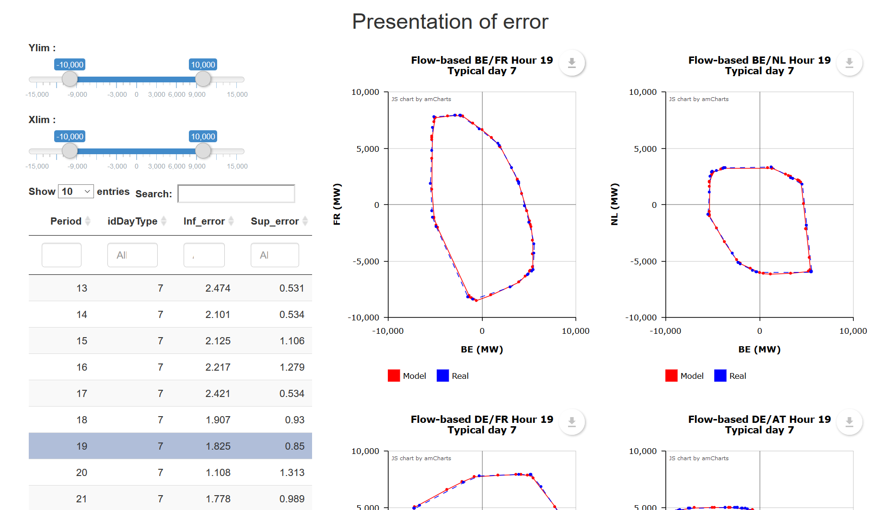
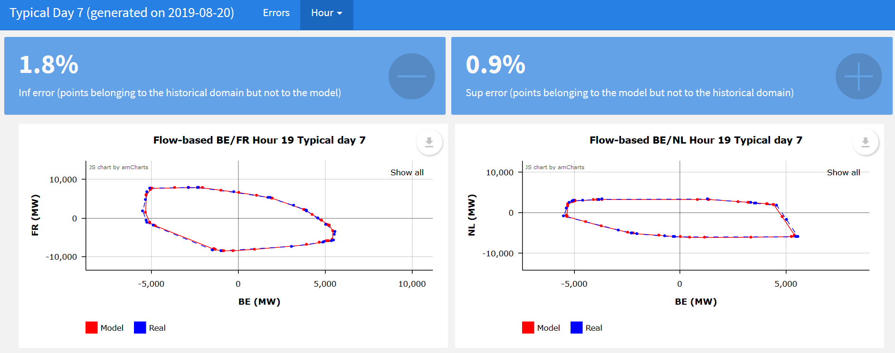

  
  
```{r setup, include=FALSE}
knitr::opts_chunk$set(echo = TRUE)
library(fbAntares)
library(manipulateWidget)
library(rAmCharts)
library(pipeR)
library(DT)
```
  
fbAntares`` allows to model **flow-based** domains into adequacy studies using the software *Antares*, with the following main functionalities: 
  
**1. Preparation of the input of an Antares study to include a modelling a flow-based in the CWE-AT area**
  
- Projection of flow-based domains on a fix basis so as to be able to describe them in Antares with binding constraints.
- Construction of probabilistic flow-based time series respecting the correlations with other inputs of the study (e.g. load, wind power generation, solar generation).
- Automatic filling of the inputs of the Antares study 
  
**2. Post-processing and visualisation of Antares’ results**
  
- Visualisation of the net-positions of the countries of the CWE area along with the limits imposed by the flow-based domains
  
  
This vignette describe the first set of functionnalities : the preparation of the inputs for the Antares study.
  
## 1 - Summary
  
```{r, eval=FALSE}

#Convert domains from PTDF file, save the output in the directory "model1"
computeFB(PTDF = system.file("/input/ptdf/ptdfraw.csv", package = "fbAntares"), verbose = 1, nbFaces = 75, outputName = "D:/model1")

#Generate reports from the output of computeFB
domainesFB <- readRDS("D:/model1/domainesFB.rds")
for (day in domainesFB$idDayType) {
generateReportFb(dayType = day allFB = domainesFB)
}

# To check on the modelization results
getMaxImportExport(domainesFB)

#Set antares study path
antaresRead::setSimulationPath("D:/exemple_test", 0)

#Create flow-based time series considering their correlations with other inputs of an Antares Study, save the output in the directory "model1"
calendar <- system.file("calendar/calendar.txt", package = "fbAntares")
createFBTS(probabilityMatrix = probabilityMatrix, multiplier = multiplier,
calendar = calendar, firstDay = firstDay, outputPath = "D:/model1")


#Set setFlowbased directory path
setFlowbasedPath(path = "D:/model1")


#Run shiny application to visualize the results of the convertion
runAppError()

#Initialize the Antares study
initFlowBased(scenario = rep(1:200, times = 5))

```

## 2 - Projection of domains

### a - Function presentation

The function ``computeFB()`` converts flow-based domains (e.g. historical flow-based domains of some "typical representative days") into an Antares model with fixed PTDF. It uses the main following parameters :

* ``PTDF`` : PTDF file path
* ``outputName`` : name of output directory

``PTDF`` is a csv file with the following columns :

* ``Date`` : Id of typical day (integer)
* ``Period`` : Hour (integer from 1 to 24), period i corresponds to the hourly time-step [i-1 ; i]
*  ptdf columns, for example :
* ``ptdfBE``
* ``ptdfDE``
* ``ptdfFR``
* ``ptdfNL``
* ``ptdfAT``
* ``ram`` : margin
* ``Class`` : class of typical day (for example WinterSe)
* ``idDayType`` : id of the typical day
* ``TypicalDay`` : is the day a typical day (optional)

A PTDF file at this format can be automatically generated by using the function ``writeAllTypeDays`` of the package ``fbClust``.
One can also set the following optionnal arguments of the function :

* ``dayType`` : subset of typical days to process
* ``hour`` : subset of hours to process
* ``nbFaces`` : number of binding constraints in the final Antares model (by default : 75).
* ``areaName``  The name of the area of your study, possible values are
cwe_at (default), cwe and other. If you choose other, you have to modify the csv file
of the package and use the examples to write how your area work.
* ``fixFaces`` (data.table) If you want to have fixFaces in your modelized domains, the fixFaces can only be the maximum of import (func = "min") or maximum of export (func = "max")
* ``hubDrop`` list of hubs in the ptdf, with the ones which should
sustracted to the others as the names of the arrays which themself contain the ones which be sustracted

And more, including tuning arguments for the optimization problem, see ?computeFB for more details.


The function creates a directory with the following files :

* ``weight.txt`` : PTDF for the antares model (weight of the binding constraints - constant over time)
* ``second_member.txt`` : RAM for the antares model (second member of the binding constraints - variable over the typical days and hours)
* ``domainesFB.RDS`` : Information about the modeled domains (points, errors , accuracy of the model,...)

```{r eval = FALSE}
## Example of computeFB with cwe_at
computeFB(PTDF = system.file("/input/ptdf/ptdfraw.csv", package = "fbAntares"),
          reports = FALSE, areaName = "cwe_at", 
          hubDrop = list(NL = c("BE", "DE", "FR", "AT")),
          nbFaces = 75, dayType = 1,
          fixFaces = data.table(func = "min", zone = "BE"))

## Another example with more arguments and faces clustering only on most important hours
computeFB(PTDF = system.file("testdata/2019-07-18ptdfraw.csv",
                             package = "fbAntares"),
          reports = FALSE, areaName = "cwe_at", 
          hubDrop = list(NL = c("BE", "DE", "FR", "AT")),
          nbFaces = 75, dayType = 1, 
          clusteringHours = c(7:10, 17:19), nbLines = 50000,
          maxiter = 20, thresholdIndic = 95, 
          fixFaces = data.table(func = "min", zone = "BE"))

```

### b - Validation of domains results

The function ``getMaxImportExport()`` returns a data.table and a csv if you want to.
The result is the difference between the maximum of imports and exports between the modelized domain and the real domain for the different areas

```{r}
#Generate reports from the output of computeFB
domainesFB <- readRDS(system.file("/input/model/antaresInput/domainesFB.RDS", package = "fbAntares"))

# To check on the modelization results
maxImportExport <- getMaxImportExport(domainesFB, writecsv = F)

# for a good visualisation in this vignette :
DT::datatable(maxImportExport, options = list(scrollX = TRUE))

```


## 3 - Creation of flow-based time series

### a - Presentation of the function

The previous function - ``computeFB()`` - converts the typical flow-based days in a format suited for Antares.

The next step consists in defining, for each day of each Monte-Carlo year, which typical flow-based day will be used to bound the exchanges within the CWE+ (or CWE) area. The function ``createFBTS()`` performs this task. Possible correlations between the flow-based shapes and external variables (e.g. load, wind power generation, solar generation) can be taken into account. Therefore, the function ``createFBTS()`` considers other inputs of the Antares study and the way they influence the occurences of the typical days.

The main inputs of this function are :

* ``probabilityMatrix`` : the probability matrix carry the information on the correlations between the typical days and external variables. They are calculated with the function ``getProbability()`` of the package ``fbClust``. The names of the columns of the probability matrix must correspond to inputs of the Antares study by respecting the following syntax ``area@variable`` (e.g. : ``fr@load``, ``de@solar``, ``be@wind``). If needed, the columns can be easily renamed with the function ``setNamesProbabilityMatrix()``.

* ``multiplier`` : The probability matrix levels are usually computed on normalized data (e.g. load factor for RES generation). They can be rescale to the time series of the Antares study by using a multiplier.

* ``calendar`` and ``firstDay`` : defines the calendar, i.e. the the boundaries between the different seasons (winter, summer, interseason) and the week-end days. the ``firstDay`` can be automatically identified with the function ``identifyFirstDays()`` which will look for patterns in the load time series to identify which days are saturdays and sundays.


* ``opts`` : a link toward an antares study, as returned by the function ``setSimulationPath()`` from the package ``antaresRead``.


* ``outputPath`` : directory where the file `ts.txt`, containing the time series of typical flow-based days, will be written.


An example of the use of ``createFBTS()`` is given below.

```{r, eval=FALSE}

# build probabilityMatrix with the function getProbability() from the package
# fbClust
# select an antaresStudy with the function setSimulationPath() from the package antaresRead

# rename columns of the probability matrix

matProb <- setNamesProbabilityMatrix(probabilityMatrix, 
                                     c("FR_load", "DE_wind", "DE_solar"),
                                     c("fr@load", "de@wind", "de@solar"))

# set multipliers

multiplier <- data.frame(variable = c("fr@load", "de@wind", "de@solar"),
                         coef = c(1, 71900, 61900))

# set Calendar
firstDay <- identifyFirstDay(opts = antaresStudy)
calendar <- system.file("calendar/calendar.csv", package = "fbAntares")

# create ts.txt in D:/model1
ts <- createFBTS(opts = antaresStudy, probabilityMatrix = probabilityMatrix,
                 multiplier = multiplier, calendar = calendar,
                 firstDay = firstDay, outputPath = "D:/model1")


```

### b - Validation of the results

``getStatsFBts()`` gives detailed informations about the time series generated with the previous function ``createFBTS()``. You just have to give in input the object ts generated with ``createFBTS()``, a calendar with the csv format (like the one available in "/calendar/" in the package fbAntares) and an output ("summary", "yearbyyear" or "all")

```{r}
ts <- fread(system.file("testdata/antaresInput/ts.txt", package = "fbAntares"), header = T)

statsFBts <- getStatsFBts(ts, calendar = system.file("calendar/calendar.txt", 
                                        package = "fbAntares"), output = "summary")

# for visualization in the vignette :
datatable(statsFBts, options = list(scrollX = TRUE))

```


## 4 - Set the flow-based model

Once the modeled flow-based domains have been created with ``computeFB()`` and ``createFBTS()``, they can be loaded using the following function :

* ``setFlowbasedPath()`` : set the model directory (directory in which the output of ``computeFB()`` have been saved)

```{r, eval = FALSE}
# Specify a repository
setFlowbasedPath(path = "C:/PATH/TO/INPUT")
```


The directory must contain :

* ``weight.txt`` : PTDF for the antares model (weight of the binding constraints - constant over time)
* ``second_member.txt`` : RAM for the antares model (second member of the binding constraints - variable over the typical days and hours)
* ``domainesFB.RDS`` : Information about domains (points, errors ,...)
* ``ts.txt`` : flow-based time series


## 5 - Visualization & reports

One can visualize the modeled flow-based domains, download the associated data or create a summary of the model accuracy in a html document using a **shiny** application with the function ``runAppError()``.

```{r, eval = FALSE}
runAppError()
```

<div style="text-align:center" markdown="1">

</div>


``plotFB()`` can also be used to plot one or more domains directly in R :


```{r, fig.width= 7, fig.height= 7, warning=FALSE}
# For example, using the short model available in the package
library(fbAntares)
setFlowbasedPath(model = "antaresInput")
plotFB(hour = 5:6, dayType = 1, country1 = c("FR", "DE"),
       country2 = c("DE", "NL"), areaName = "cwe_at", export = T)


```

Reports in html format can also be generated within the shiny application. This solution can be use to facilitate the transmission and communication of the results. The function to generate html reports is ``generateReportFb()``
<div style="text-align:center" markdown="1">

</div>


## 6 - Study initialization

This last step allows to prepare the inputs of an Antares study so as to include flow-based domains to bound CWE exchanges.

It is first necessary to select an antares study using ``setSimulationPath()`` function of the package ``antaresRead``, and the flow-based model which will be set on this study must be specified with ``setFlowbasedPath()``.

The initialization of the study is then done with the function ``initFlowBased()``. This function creates the inputs of the Antares study related to the flow-based modelling, with the appropriate binding constraints and virtual thermal plants.

The time-series of flow-based domains used for each Monte-Carlo years are desribed with the parameter ``scenarios``. For instance, with ``scenario = rep(1:200, times = 5)`` (default value), up to 1000 Monte-Carlo years can be simulated with 5 blocks of, successively, time series 1 to 200. This "scenario building mode" is written in the file ``user/flowbased/scenario.txt`` of the Antares Study.


```{r, eval=FALSE}
antaresRead::setSimulationPath("D:/exemple_test", 0)

# initialisation of flow-based study
initFlowBased(scenario = rep(1:200, times = 5))
```


## 7 - Run simulations

Once all these steps have been performed, the Antares study can be run as usual, for instance using the `run simulation` button of the software interface.